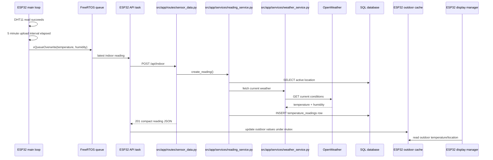

# API and Data Flow

The ESP32 firmware uploads indoor readings to this Flask backend. The backend enriches each reading with current outdoor weather for the active saved location, stores the combined reading, and returns a compact response that the firmware can show on the LCD.

## Upload Flow



The firmware queue has room for one reading. If the main loop queues a new reading while an upload is pending, the newest reading replaces the older one.

## Request Payload

```json
{
  "temperature": 72.5,
  "humidity": 41.0
}
```

Both values are floating-point numbers. Temperature is sent in Fahrenheit, matching the LCD display.

## Backend Response

```json
{
  "nickname": "Home",
  "location": "Redwood City",
  "outside_temperature": 64.2,
  "outside_humidity": 62
}
```

The firmware requires `outside_temperature` to update outdoor temperature. It uses `location` when present. Extra fields such as `nickname` and `outside_humidity` are server-provided context and remain safe for the firmware to ignore.

## Configuration Boundary

The firmware endpoint is configured at compile time:

```ini
-DWEATHER_API_URL=\"https://example.com/api/indoor\"
```

If `WEATHER_API_URL` is empty, uploads are skipped by the firmware. The backend still owns the OpenWeather API key and saved location selection.

