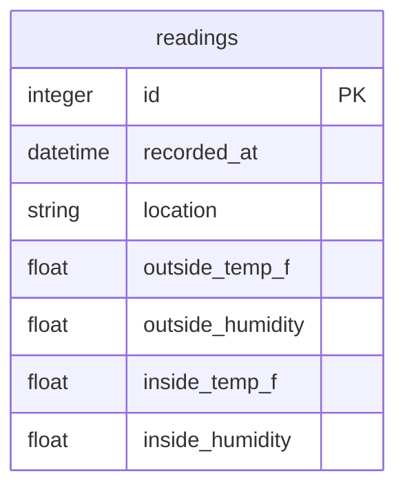

# Database Design

## Database Choice

I chose PostgreSQL for deployment, while local development defaults to SQLite at `/tmp/esp32_temperature.db` when `DATABASE_URL` is not set.
The application uses SQLAlchemy through Flask-SQLAlchemy as a wrapper to handle database calls.

## Schema

The current schema has one table: `readings`.

## Table: `readings`

| Column | Type | Purpose |
| --- | --- | --- |
| `id` | Integer | Primary key. |
| `recorded_at` | DateTime with timezone | Server-side timestamp created when the reading is saved. |
| `location` | String(120) | Location used for OpenWeather lookup. |
| `outside_temp_f` | Float | Outdoor temperature from OpenWeather in Fahrenheit. |
| `outside_humidity` | Float | Outdoor relative humidity percentage from OpenWeather. |
| `inside_temp_f` | Float | Indoor temperature reported by the ESP32 in Fahrenheit. |
| `inside_humidity` | Float | Indoor relative humidity percentage reported by the ESP32. |

## Write Path

1. `POST /api/indoor` receives JSON from the ESP32.
2. `routes/sensor_data.py` parses the request body and validates that `location` is present.
3. The route passes `location`, `temperature`, and `humidity` to `services/reading_service.py`.
4. `services/reading_service.py` fetches current outdoor weather for that location through `services/openweather.py`.
5. If the location cannot be resolved or OpenWeather fails, no database row is created.
6. When weather data is available, a `Reading` model instance is created with both indoor sensor values and outdoor weather values.
7. `ensure_schema()` calls `db.create_all()`.
8. The reading is added to the session and committed.
9. If the commit fails, the session is rolled back and the failure is logged.

The write path logs validation outcomes, weather lookup results, reading construction, successful saves, and database commit failures. Logs do not include API keys or database credentials.

## Read Patterns

`routes/sensor_data.py` parses request parameters, while `services/reading_service.py` handles the database queries for three main read patterns:

- Latest reading: `Reading.query.order_by(Reading.recorded_at.desc()).first()`
- Recent history: filter by `recorded_at >= cutoff`, ordered ascending
- Paginated table: count all rows, then apply order, offset, and limit

Supported table sort columns:

- `id`
- `recorded_at`
- `inside_temp_f`
- `inside_humidity`
- `outside_temp_f`
- `outside_humidity`
