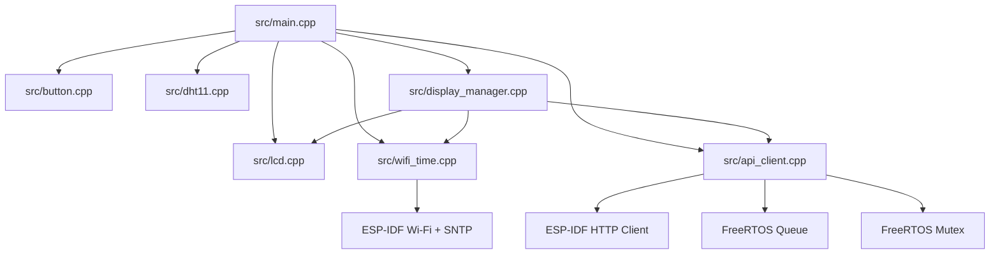
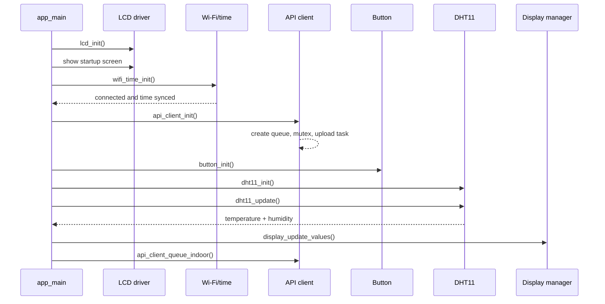
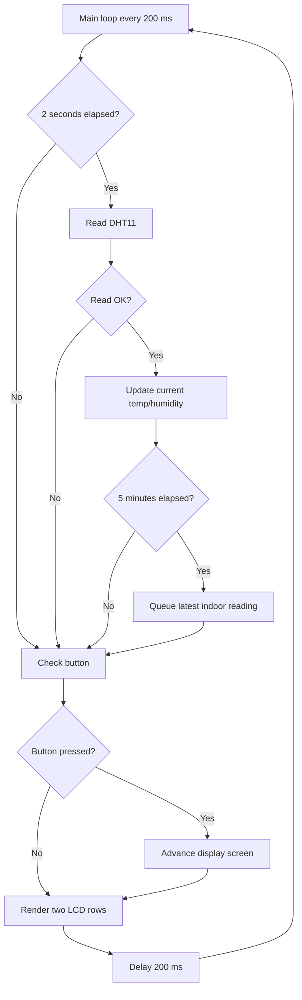
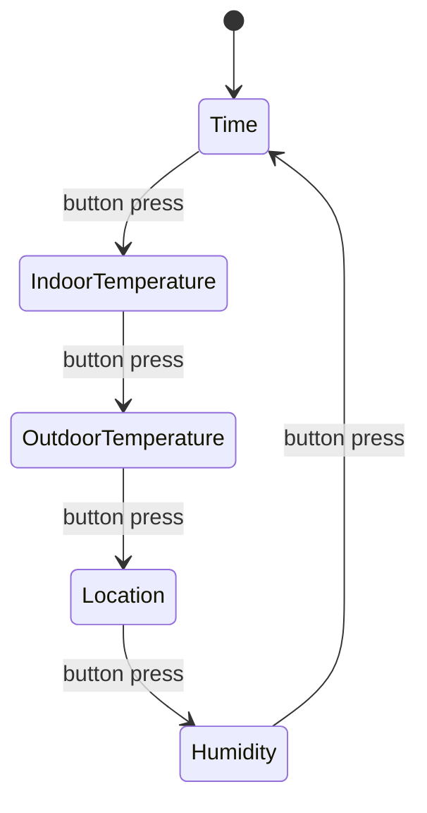

# Firmware Architecture

The ESP32 firmware is organized around a polling loop in `src/main.cpp` plus a background FreeRTOS task for API uploads. This document summarizes the firmware behavior that matters to this Flask backend.

## Modules



## Startup Sequence



`wifi_time_init()` blocks until the ESP32 is connected and the system clock is synchronized. After that, the main loop begins updating sensor and display state.

## Main Loop



The DHT11 is sampled every 2 seconds. Successful readings update the display immediately. Uploads are queued every 5 minutes using the latest successful reading.

## Display Rotation



The LCD renders the selected screen on row 1 and the next screen on row 2. Long location names scroll horizontally.

## API Contract

The firmware posts indoor readings to this backend:

```http
POST /api/indoor
Content-Type: application/json
```

```json
{
  "temperature": 72.4,
  "humidity": 45.8
}
```

Successful response:

```http
201 Created
```

```json
{
  "nickname": "Home",
  "location": "Redwood City",
  "outside_temperature": 68.2,
  "outside_humidity": 62
}
```

The firmware requires `outside_temperature` to update the outdoor temperature display. It uses `location` when present and can ignore additional fields. The backend stores the full reading and caches OpenWeather results for five minutes per location.

## Timing

| Activity | Interval |
| --- | --- |
| Main loop delay | 200 ms |
| DHT11 read | 2 seconds |
| API upload queue | 5 minutes |
| Location scroll step | 450 ms |

## Error Handling

| Status | Meaning | Firmware behavior |
| ---: | --- | --- |
| `201` | Reading stored | Continue normal sampling schedule. |
| `400` | Invalid request or unknown active weather location | Log the error and avoid tight retry loops until configuration changes. |
| `502` | Weather lookup failed | Retry later with backoff. |
| `503` | Server missing OpenWeather config | Retry slowly; this is a server configuration problem. |
| Network timeout | Server unavailable or Wi-Fi issue | Reconnect Wi-Fi and retry later. |
