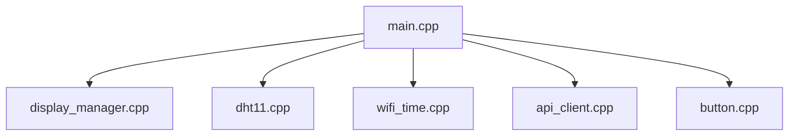

# Firmware Architecture



## Scope

The ESP32 firmware should:

- Connect to Wi-Fi.
- Synchronize the internal clock.
- Read indoor temperature in Fahrenheit.
- Read indoor relative humidity percentage.
- Build a JSON payload with `location`, `temperature`, and `humidity`.
- POST the payload to the Flask server.
- Request current outdoor weather from the Flask server and display it on the LCD.

## API Contract

Endpoint options:

```http
POST /api/indoor
```

Headers:

```http
Content-Type: application/json
```

Body:

```json
{
  "location": "Redwood City",
  "temperature": 72.4,
  "humidity": 45.8
}
```

Successful response:

```http
201 Created
```

The response body is the stored reading, including server-generated `id`, `recorded_at`, and outdoor weather values.
The server saves the reading only after it successfully fetches current outdoor weather for the requested location.

## Error Handling

Firmware should handle these cases:

| Status | Meaning | Firmware behavior |
| ---: | --- | --- |
| `201` | Reading stored | Continue normal sampling schedule. |
| `400` | Missing `location`, invalid payload, or unknown weather location | Log the error and avoid tight retry loops until configuration changes. |
| `502` | Weather lookup failed | Retry later with backoff. |
| `503` | Server missing OpenWeather config | Retry slowly; this is a server configuration problem. |
| Network timeout | Server unavailable or Wi-Fi issue | Reconnect Wi-Fi and retry later. |
