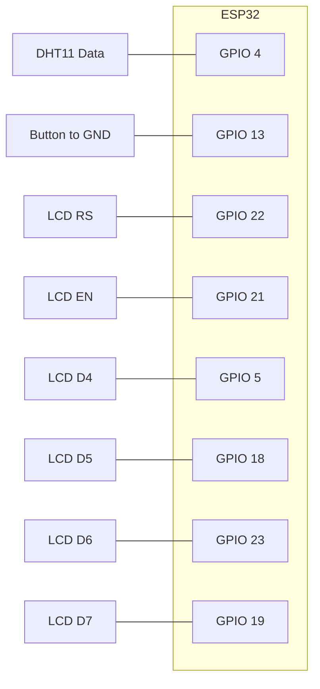

# Hardware and Wiring

The firmware client targets an ESP32 development board using the PlatformIO `esp32dev` environment. This backend does not directly control hardware, but the wiring below explains the device that sends readings to `POST /api/indoor`.

## Component Map

## GPIO Assignments

| Component | Signal | ESP32 GPIO | Firmware source |
| --- | --- | --- | --- |
| DHT11 | Data | GPIO 4 | `src/dht11.cpp` |
| Button | Input | GPIO 13 | `src/button.cpp` |
| LCD | RS | GPIO 22 | `src/lcd.cpp` |
| LCD | EN | GPIO 21 | `src/lcd.cpp` |
| LCD | D4 | GPIO 5 | `src/lcd.cpp` |
| LCD | D5 | GPIO 18 | `src/lcd.cpp` |
| LCD | D6 | GPIO 23 | `src/lcd.cpp` |
| LCD | D7 | GPIO 19 | `src/lcd.cpp` |

## Button Wiring

The firmware enables the ESP32 internal pull-up on GPIO 13. A press pulls the pin low, and `button_pressed()` detects the falling edge with a short debounce delay.

## LCD Wiring Notes

The LCD is driven in 4-bit parallel mode. The firmware controls RS, EN, and D4-D7. Wire LCD power, ground, contrast, and backlight according to your LCD module.

## Sensor Notes

The DHT11 reading routine sends the start pulse, waits for the sensor response, reads 40 bits, validates the checksum, and converts Celsius to Fahrenheit before updating shared sensor values.
