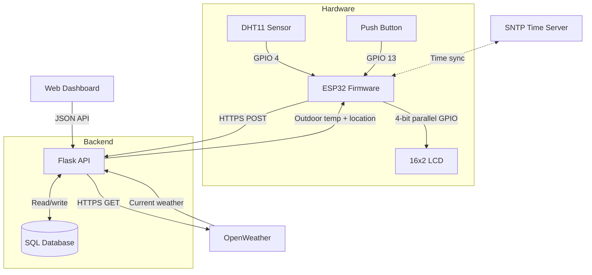

# Documentation

This directory contains focused notes for the Flask backend and its ESP32 firmware client.

## Pages

- [Project Overview](project-overview.md): system goals, workflow, technology choices, and future improvements.
- [API and Data Flow](api-flow.md): ESP32 upload contract, backend ingestion flow, and response behavior.
- [Sequence Diagram](sequence-diagram.md): request and dashboard flows through the backend.
- [Database Design](database-design.md): SQL schema, write path, and read patterns.
- [Firmware Architecture](firmware-architecture.md): summary of the ESP32 client modules and timing.
- [Hardware and Wiring](hardware.md): ESP32 component wiring used by the firmware repo.
- [Engineering Decisions](tradeoffs-and-decisions.md): design tradeoffs for backend, firmware, data, and tests.

## System Overview

The ESP32 owns local sensing, LCD display, Wi-Fi, and periodic upload scheduling. This repository owns the Flask API, weather enrichment, database storage, saved locations, and browser dashboard.
