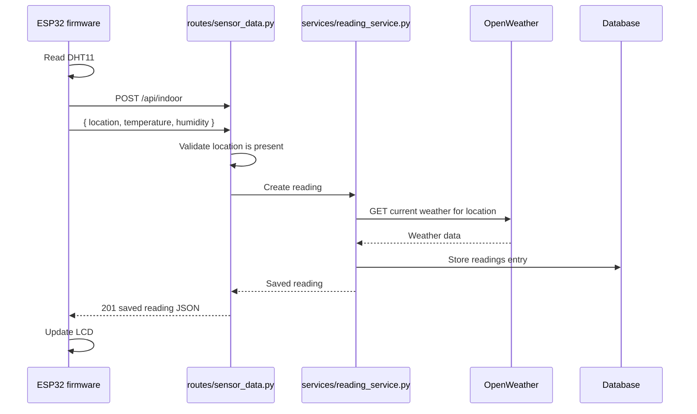
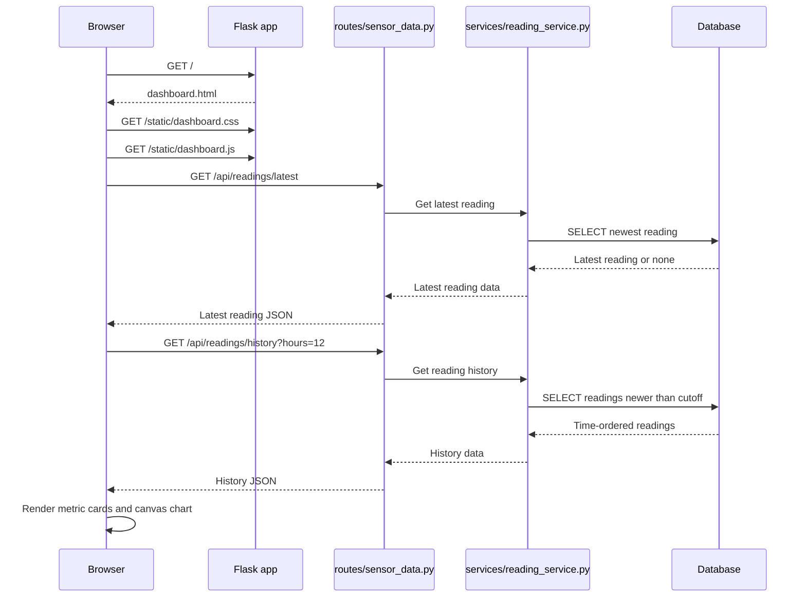

# Sequence Diagram

## ESP32 Sensor Data Flow

## Dashboard Load And Refresh

## Error Responses

The API uses compact JSON error responses:

| Scenario | Status | Response |
| --- | ---: | --- |
| Missing `location` on POST | `400` | `{ "error": "location is required" }` |
| Unknown weather location | `400` | `{ "error": "Could not find weather for <location>" }` |
| Unsupported `sort_by` | `400` | `{ "error": "sort_by is not supported" }` |
| Invalid `sort_dir` | `400` | `{ "error": "sort_dir must be asc or desc" }` |
| Invalid history `hours` | `400` | `{ "error": "hours must be a number" }` |
| OpenWeather key missing | `503` | `{ "error": "Weather service is not configured" }` |
| OpenWeather request failure | `502` | `{ "error": "Could not fetch current weather" }` |
